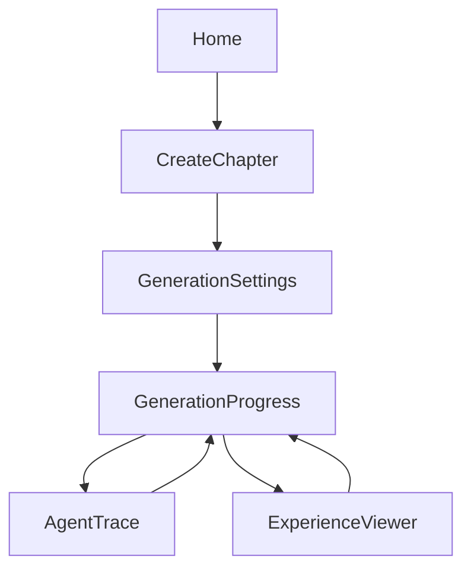

# ChapterStage — KMP Frontend Coding Agent Handoff

**Date:** 2026-06-14  
**Owner:** KMP frontend coding agent  
**Product:** ChapterStage  
**Frontend stack:** Kotlin Multiplatform + Compose Multiplatform  
**Backend:** FastAPI REST + SSE  
**Final experience rendering:** Hosted HTML/CSS/JS opened in browser/WebView

---

## 0. Objective

Build a Kotlin Multiplatform frontend for ChapterStage. The app should let users upload/paste chapter content, configure the desired learning experience, start generation, watch Band-agent progress, inspect the agent trace, and open the generated chapter mini-site in an embedded WebView/browser.

The KMP frontend should **not** implement a custom slide renderer. Rendering is delegated to the generated public HTML/CSS/JS URL returned by the backend.

---

## 1. Current Documentation Grounding

Use the official docs below as implementation references.

### Kotlin Multiplatform + Compose Multiplatform

- Kotlin Multiplatform is intended for sharing code across platforms.
- Compose Multiplatform supports shared UI for Android and iOS; web exists but should not be a dependency for this MVP.

References:

- https://kotlinlang.org/multiplatform/
- https://kotlinlang.org/compose-multiplatform/
- https://developer.android.com/compose

### Ktor Client

Use Ktor Client for shared HTTP networking.

Reference:

- https://ktor.io/

### kotlinx.serialization

Use `@Serializable` DTOs shared across Android/iOS.

References:

- https://kotlinlang.org/docs/serialization.html
- https://github.com/Kotlin/kotlinx.serialization

---

## 2. Frontend Product Responsibilities

The frontend is the control panel and viewer.

It must support:

1. Onboarding / product explanation.
2. Create chapter from pasted text.
3. Upload PDF/TXT file.
4. Select generation settings:
   - audience level
   - experience style
   - target screen count
   - auto-brainstorm enabled/disabled
5. Start generation job.
6. Show live progress from SSE.
7. Show Band agent trace.
8. Show generated experience preview card.
9. Open final generated URL in WebView/browser.
10. Show errors and retry affordances.

It must **not**:

- parse generated site HTML
- implement per-platform visualization logic
- store Band credentials
- call LLM providers directly
- expose backend secrets

---

## 3. Recommended KMP Project Structure

```text
chapterstage-kmp/
  composeApp/
    build.gradle.kts
    src/
      commonMain/
        kotlin/
          app/
            App.kt
            navigation/
              Routes.kt
              AppNavigator.kt
            di/
              AppModule.kt
            design/
              Theme.kt
              Colors.kt
              Typography.kt
              Spacing.kt
            data/
              remote/
                ChapterStageApi.kt
                SseClient.kt
                HttpClientFactory.kt
              dto/
                ChapterDtos.kt
                JobDtos.kt
                ExperienceDtos.kt
                TraceDtos.kt
              repository/
                ChapterRepository.kt
                JobRepository.kt
            domain/
              model/
                Chapter.kt
                GenerationJob.kt
                AgentTraceEvent.kt
                Experience.kt
              usecase/
                CreateTextChapterUseCase.kt
                UploadChapterUseCase.kt
                StartGenerationJobUseCase.kt
                ObserveGenerationEventsUseCase.kt
            presentation/
              onboarding/
              home/
              create/
              generation/
              trace/
              viewer/
              components/
        resources/
      androidMain/
        kotlin/
          platform/
            FilePicker.android.kt
            WebExperienceView.android.kt
      iosMain/
        kotlin/
          platform/
            FilePicker.ios.kt
            WebExperienceView.ios.kt
```

---

## 4. Screens

### 4.1 Home Screen

Purpose: Explain product and start a new chapter experience.

Content:

- Product title: `ChapterStage`
- Subtitle: `Turn dense chapters into interactive visual learning experiences.`
- Primary CTA: `Create Chapter Experience`
- Secondary CTA: `View Recent Jobs`
- Small explainer: `Powered by Band multi-agent collaboration`

### 4.2 Create Chapter Screen

Tabs:

```text
Paste Text
Upload File
```

Fields:

```text
Book title optional
Chapter title optional
Chapter text / selected file
```

Actions:

```text
Continue to Settings
```

Validation:

- Text min: 500 chars.
- File types: PDF/TXT.
- Show readable backend errors.

### 4.3 Generation Settings Screen

Controls:

```text
Audience level: Beginner / Intermediate / Expert
Experience style: Visual Story / Lecture Mode / Concept Map First / Quiz First / Case Study
Target screen count: 6 / 8 / 10
Auto-Brainstorm: On/Off
```

Primary CTA:

```text
Start Agent Workflow
```

### 4.4 Generation Progress Screen

Show current status:

```text
Queued
Extracting chapter
Creating Band room
Structure Agent working
Pedagogy Agent reviewing
Auto-Brainstorm Agent generating concepts
Visual Builder creating website
Verifier checking output
Publishing experience
Completed
```

UI components:

- progress bar
- current step label
- live event feed
- agent avatars/chips
- CTA to view trace
- CTA to open final experience when ready

### 4.5 Agent Trace Screen

Purpose: Make Band collaboration visible.

Display:

- Band room ID/link if available
- timeline of agent events
- agent name
- event type
- summary message
- time
- payload preview if useful

Useful event labels:

```text
Delegated
Analyzed
Brainstormed
Rejected
Selected
Generated
Verified
Published
```

### 4.6 Experience Viewer Screen

Purpose: Render final hosted site.

Input:

```kotlin
publicUrl: String
```

Behavior:

- Open in in-app WebView where possible.
- Provide fallback `Open in Browser` action.
- Show loading state.
- Show failed-load state with retry.
- Avoid injecting custom JS.

---

## 5. Navigation Flow



---

# 6. API Client Contract

Base URL should be injected through config:

```kotlin
const val API_BASE_URL = "https://api.chapterstage.dev/api/v1"
```

For local development:

```text
Android emulator: http://10.0.2.2:8000/api/v1
iOS simulator: http://localhost:8000/api/v1
```

---

## 6.1 DTOs

### `CreateTextChapterRequest`

```kotlin
@Serializable
data class CreateTextChapterRequest(
    val bookTitle: String? = null,
    val chapterTitle: String? = null,
    val text: String
)
```

Backend JSON keys use snake_case. Configure serialization mapping either with `@SerialName` or global naming strategy if available.

Preferred explicit version:

```kotlin
@Serializable
data class CreateTextChapterRequest(
    @SerialName("book_title") val bookTitle: String? = null,
    @SerialName("chapter_title") val chapterTitle: String? = null,
    val text: String
)
```

### `ChapterResponse`

```kotlin
@Serializable
data class ChapterResponse(
    @SerialName("chapter_id") val chapterId: String,
    @SerialName("book_id") val bookId: String,
    val title: String? = null,
    @SerialName("source_type") val sourceType: String,
    @SerialName("created_at") val createdAt: String
)
```

### `StartGenerationJobRequest`

```kotlin
@Serializable
data class StartGenerationJobRequest(
    @SerialName("chapter_id") val chapterId: String,
    @SerialName("audience_level") val audienceLevel: AudienceLevel,
    @SerialName("experience_style") val experienceStyle: ExperienceStyle,
    @SerialName("target_screen_count") val targetScreenCount: Int,
    @SerialName("enable_auto_brainstorm") val enableAutoBrainstorm: Boolean = true
)
```

### Enums

```kotlin
@Serializable
enum class AudienceLevel {
    @SerialName("beginner") Beginner,
    @SerialName("intermediate") Intermediate,
    @SerialName("expert") Expert
}

@Serializable
enum class ExperienceStyle {
    @SerialName("visual_story") VisualStory,
    @SerialName("lecture_mode") LectureMode,
    @SerialName("concept_map_first") ConceptMapFirst,
    @SerialName("quiz_first") QuizFirst,
    @SerialName("case_study") CaseStudy
}
```

### `GenerationJobStartResponse`

```kotlin
@Serializable
data class GenerationJobStartResponse(
    @SerialName("job_id") val jobId: String,
    @SerialName("chapter_id") val chapterId: String,
    val status: String,
    @SerialName("status_url") val statusUrl: String,
    @SerialName("events_url") val eventsUrl: String
)
```

### `GenerationJobResponse`

```kotlin
@Serializable
data class GenerationJobResponse(
    @SerialName("job_id") val jobId: String,
    @SerialName("chapter_id") val chapterId: String,
    val status: String,
    val progress: Double,
    @SerialName("current_step") val currentStep: String,
    @SerialName("band_room_id") val bandRoomId: String? = null,
    @SerialName("experience_id") val experienceId: String? = null,
    @SerialName("public_url") val publicUrl: String? = null,
    val error: ApiErrorBody? = null,
    @SerialName("created_at") val createdAt: String,
    @SerialName("updated_at") val updatedAt: String
)
```

### `ApiErrorResponse`

```kotlin
@Serializable
data class ApiErrorResponse(
    val error: ApiErrorBody
)

@Serializable
data class ApiErrorBody(
    val code: String,
    val message: String,
    val details: Map<String, String> = emptyMap()
)
```

### `AgentTraceResponse`

```kotlin
@Serializable
data class AgentTraceResponse(
    @SerialName("job_id") val jobId: String,
    @SerialName("band_room_id") val bandRoomId: String? = null,
    val events: List<AgentTraceEventDto>
)

@Serializable
data class AgentTraceEventDto(
    val id: String,
    @SerialName("agent_name") val agentName: String? = null,
    @SerialName("event_type") val eventType: String,
    val title: String,
    val message: String,
    @SerialName("created_at") val createdAt: String
)
```

---

## 6.2 Endpoints Consumed by Frontend

### Health

```text
GET /health
```

### Create chapter from text

```text
POST /chapters/text
```

### Upload chapter file

```text
POST /chapters/upload
multipart/form-data
```

### Start generation

```text
POST /generation-jobs
```

### Fetch job status

```text
GET /generation-jobs/{job_id}
```

### Stream job events

```text
GET /generation-jobs/{job_id}/events
Accept: text/event-stream
```

### Fetch agent trace

```text
GET /generation-jobs/{job_id}/trace
```

### Fetch experience metadata

```text
GET /experiences/{experience_id}
```

---

## 7. SSE Handling

The frontend should connect to SSE after receiving `job_id`.

Expected events:

```text
job_progress
agent_message
brainstorm_variant
validation_report
experience_ready
job_failed
heartbeat
```

KMP implementation options:

1. Implement a simple streaming client with Ktor and parse `text/event-stream` lines.
2. Use platform-specific SSE implementation if faster.
3. Fallback: poll `GET /generation-jobs/{job_id}` every 2 seconds if SSE fails.

Required behavior:

- Reconnect if disconnected while job is not terminal.
- Stop stream on `completed`, `failed_*`, or `cancelled`.
- Keep latest progress in screen state.
- Store received agent events in the trace screen state.

---

## 8. Shared State Model

Use a view model/state-holder pattern.

```kotlin
data class GenerationProgressUiState(
    val jobId: String? = null,
    val status: String = "idle",
    val progress: Float = 0f,
    val currentStep: String = "",
    val agentEvents: List<AgentEventUiModel> = emptyList(),
    val publicUrl: String? = null,
    val isLoading: Boolean = false,
    val errorMessage: String? = null
)
```

---

## 9. Platform-Specific Requirements

### Android

- Use Android WebView or a KMP WebView wrapper.
- Enable JavaScript only if generated site requires it.
- Do not enable file access unless needed.
- Do not inject credentials.
- Test with Android emulator and real device.

### iOS

- Use `WKWebView` through expect/actual or KMP WebView wrapper.
- Allow loading backend local URL in debug with proper App Transport Security config if needed.
- Test on iOS simulator and at least one device if available.

---

## 10. UI Design Requirements

Frontend should feel like an AI workflow product, not a generic file uploader.

Visual keywords:

```text
calm
intelligent
agentic
educational
traceable
creative
```

Core components:

- primary action button
- pill selector
- file upload card
- large text input
- progress timeline
- agent avatar chips
- trace event card
- generated experience card
- WebView loading/error states

---

## 11. Error States

Map backend errors to user-friendly messages.

```text
INVALID_FILE_TYPE → Only PDF and TXT files are supported right now.
FILE_TOO_LARGE → This file is too large for the MVP. Try a smaller chapter.
CHAPTER_TOO_SHORT → Add more chapter content before generating.
EXTRACTION_FAILED → We could not extract readable text from this file.
AGENT_WORKFLOW_FAILED → The agent workflow failed. Try again.
SITE_VALIDATION_FAILED → The generated experience failed safety checks. Try regenerating.
```

---

## 12. Implementation Milestones

### Milestone 1 — UI shell

- App theme.
- Navigation.
- Home screen.
- Create Chapter screen.
- Settings screen.

### Milestone 2 — API client

- Ktor client setup.
- Serialization setup.
- Text chapter API.
- Start job API.
- Job status polling.

### Milestone 3 — Upload support

- Android file picker.
- iOS file picker.
- Multipart upload.

### Milestone 4 — Live progress

- SSE or polling fallback.
- Progress screen event feed.
- Agent chips/timeline.

### Milestone 5 — Trace + viewer

- Trace screen.
- Experience viewer screen.
- WebView integration.
- Browser fallback.

### Milestone 6 — Demo polish

- Empty/error/loading states.
- Recent jobs list if backend supports it.
- Final demo flow recording.

---

## 13. Frontend Definition of Done

Frontend MVP is complete when:

- User can paste chapter text and create a chapter.
- User can upload PDF/TXT on Android and iOS.
- User can choose generation settings.
- User can start a generation job.
- User can see progress updates.
- User can see agent trace events.
- User can open final generated URL inside WebView or external browser.
- Backend error messages are handled cleanly.
- No frontend code depends on parsing custom slide JSON.
